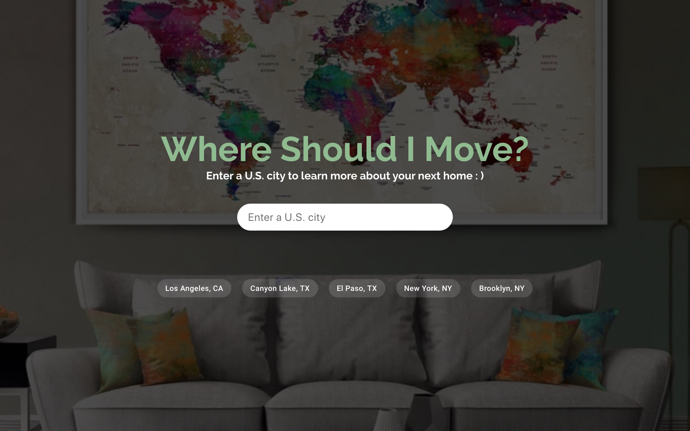

 

  

# Should I Move Here? (React)

A front-end React web application that asks the user to input a US city, then provides information related to the provided city.

This is an application I originally made using Javascript/JQuery during my coding bootcamp (my first group project). This repo is a re-make of that site I have made using the React framework, and currently implementing Redux for state management. Currently, the site uses React Hooks to provide 'state' to functional components.

I used this site as an opportunity to practice using CSS grid, async/await, React hooks, and Redux is next.

## API's Used

- Zomato (Restaurants Information)
- DarkSky (Weather Information)
- OpenBreweryDB (Local Breweries)
- Google Places API (Autocomplete city search)

## Deployed Site

[https://mystifying-clarke-a929cc.netlify.com/](https://mystifying-clarke-a929cc.netlify.com/)
